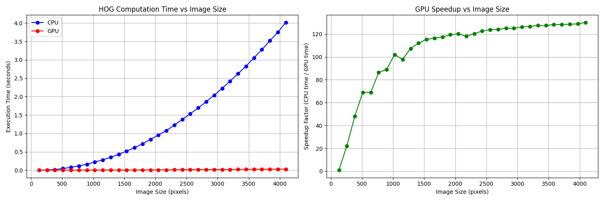

# Histogram of Oriented Gradients: Computation Benchmarking

This project benchmarks the performance of the Histogram of Oriented Gradients (HOG) feature descriptor using both CPU and GPU implementations. The primary goal is to measure execution times across various image sizes and demonstrate the speedup provided by GPU acceleration.



## Setup

### Install Required Packages

```bash
pip install numpy matplotlib
```

**Note**: These benchmarks were tested using Python 3.10.

### OpenCV with CUDA Support

This project leverages OpenCV with CUDA enabled for GPU-accelerated computations. To use OpenCV with CUDA support, ensure both OpenCV and CUDA are correctly configured on your system:

1. **Build OpenCV from Source**: 
   - Clone the [OpenCV repository](https://github.com/opencv/opencv) and the [OpenCV Contrib repository](https://github.com/opencv/opencv_contrib).
   
2. **Follow Official OpenCV Build Instructions**
   - Refer to the [OpenCV documentation](https://docs.opencv.org/master/d7/d9f/tutorial_linux_install.html) for comprehensive build instructions.
